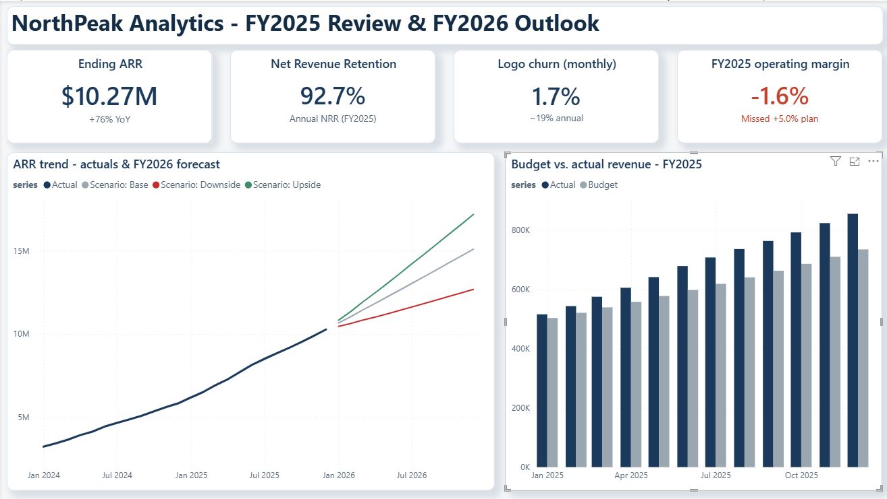
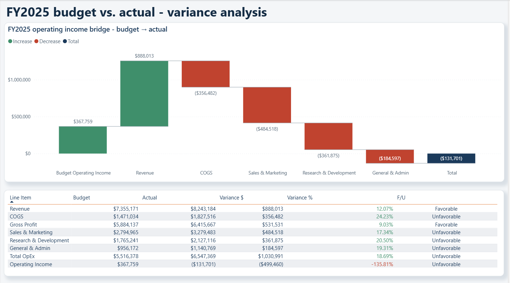
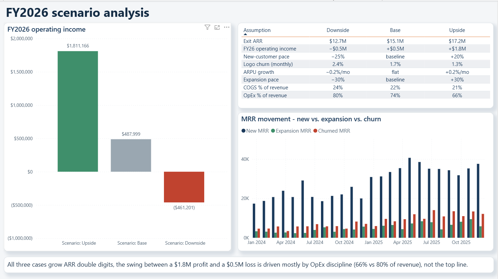

# NorthPeak Analytics - SaaS FP&A & Forecasting Model

A complete, end-to-end **Financial Planning & Analysis** project for a fictional
~$10M ARR B2B SaaS company. It does what an FP&A analyst actually does - forecast
revenue from operating drivers, explain the gap between plan and reality, frame the
range of outcomes for leadership, and brief the result to a CFO - but builds it as
a **reproducible, backtested, self-checking pipeline** instead of a one-off workbook.

> **All data is synthetic**, generated to model a realistic SaaS business. No real or proprietary data is used.

---

## The business story

NorthPeak entered FY2024 with ~220 customers and ~$3.2M ARR. Over 24 months it grew
to **$10.3M ARR / 625 customers** through three levers - new-customer acquisition,
expansion from the base, and churn. In Dec-2024 leadership set an optimistic FY2025
budget (3.5% MoM growth, tighter costs). **Reality:** revenue *beat* plan by 12%,
but every cost line ran 17-24% over, so a budgeted +$368K operating profit became a
**-$132K loss**. This project quantifies that story and projects FY2026.

---

## Highlights

### Power BI executive dashboard
Built from the pipeline's tidy data export - three pages, navy/orange/green/red theme. Build spec in [DASHBOARD_GUIDE.md](outputs/DASHBOARD_GUIDE.md).

**Page 1 - Executive summary** · KPI cards (ARR, NRR, churn, margin), ARR actuals + scenario fan, budget vs. actual


**Page 2 - Variance** · FY2025 operating-income waterfall + line-by-line variance table


**Page 3 - Scenarios** · FY2026 operating income by case, the assumptions that drive them, and MRR movement (new vs. expansion vs. churn - the retention story)


📄 **[Read the 1-page Executive Memo →](outputs/EXECUTIVE_MEMO.md)**

<details>
<summary><b>Static charts</b> (generated by the Python scripts - <code>outputs/figures/</code>)</summary>

The pipeline also emits presentation-quality matplotlib charts: the [ARR forecast](outputs/figures/forecast_fy2026.png) (backtested to 3.9% MAPE), the [variance bridge](outputs/figures/variance_bridge.png), and the [scenario fan](outputs/figures/scenario_arr.png).
</details>

---

## The four analyses

| # | Component | What it does | Output |
|---|---|---|---|
| 2 | **Driver-based forecast** | Forecasts new customers, churn, ARPU & expansion, then rolls them up to MRR/ARR via the SaaS revenue walk. Holt damped-trend (statsmodels). **Backtested** on a 6-month holdout. | `forecast_fy2026.csv`, 2 charts |
| 3 | **Variance engine** | Joins FY2025 budget to actuals; computes $/% variance per line with favorable/unfavorable + materiality flags; builds the operating-income waterfall. | `variance_analysis.xlsx`, 2 charts |
| 4 | **Scenario analysis** | Base / Upside / Downside off a labeled assumptions dict (6 levers); ARR + operating income per case. Base reproduces Component 2 exactly. | `scenarios.csv`, 1 chart |
| 5 | **Executive deliverables** | Power BI-ready tidy dataset + build guide, and a CFO memo. | `dashboard_data.csv`, `DASHBOARD_GUIDE.md`, `EXECUTIVE_MEMO.md` |

**Key results:** FY2026 Base ARR **$15.1M (+47%)**; scenario range **$12.7M-$17.2M**;
the swing between an operating profit and a loss is driven by **OpEx discipline**, not the top line.

---

## What this demonstrates

| Skill shown | FP&A competency |
|---|---|
| Driver-based revenue model (new × ARPU - churn + expansion) | Builds revenue bottoms-up the way a SaaS business compounds - not a flat % |
| Holt/exponential-smoothing forecast + **holdout backtest & MAPE** | Forecasting with an honest, quantified accuracy claim |
| Baseline-vs-model comparison | Knows a forecast is only credible against an alternative |
| Budget-vs-actual variance, F/U sign convention, materiality flags | Core management-reporting / month-end variance work |
| Operating-income **waterfall bridge** | Decomposing a P&L gap into its drivers for executives |
| Scenario planning with toggleable assumptions | Range-based planning, sensitivity to the levers leadership controls |
| SaaS metrics (ARR/MRR, NRR, logo churn, Rule of 40) | Speaks the language of a SaaS finance team |
| `validate.py` - 46 reconciliation & sanity checks | Controls mindset: numbers tie out before they ship |
| Executive memo + Power BI handoff | Translates analysis into a decision and a deliverable |

---

## Why Python and not just Excel?

Honestly - **a strong analyst could build most of this in Excel**, and for a one-off
ask, Excel is faster. The variance table is a pivot table; the bridge is a stacked
column. This project is in Python for the things Excel does *poorly*:

- **Reproducibility** - `python src/forecast.py` regenerates every number and chart
  from raw data, identically, every time. No stale tabs, no broken references.
- **A real backtest** - refitting the model on a rolling holdout and scoring MAPE vs.
  a baseline is painful in a spreadsheet and is exactly the credibility step most
  Excel forecasts skip.
- **One source of truth** - the scenario engine *is* the forecast engine (Base ties to
  the forecast to the penny), and `validate.py` proves all 46 identities reconcile.

The point isn't "Python beats Excel" - it's **using the right tool, and reaching for
code when reproducibility and validation matter.** The data is exported tidy/long so
the final consumer (Power BI / Excel) gets clean inputs either way.

---

## How to run

```bash
pip install -r requirements.txt

python src/forecast.py     # Component 2 - forecast + backtest
python src/variance.py     # Component 3 - budget vs. actuals + bridge
python src/scenarios.py    # Component 4 - scenarios
python src/dashboard.py    # Component 5 - Power BI dataset
python src/validate.py     # reconciliation & sanity checks (46/46 must pass)
```

Each script runs standalone and prints a short summary. Outputs land in `outputs/`
(CSVs, the Excel workbook, the memo and guide) and `outputs/figures/` (charts).

```
src/
├── utils.py        # data loading, metrics (MAPE/sMAPE), chart style
├── forecast.py     # Component 2 - driver-based forecast + backtest
├── variance.py     # Component 3 - budget-vs-actuals + waterfall
├── scenarios.py    # Component 4 - Base/Upside/Downside
├── dashboard.py    # Component 5 - tidy Power BI export
└── validate.py     # cross-component reconciliation checks
```

---

## Tech

Python 3 · pandas · numpy · statsmodels · scikit-learn · matplotlib · openpyxl.
Power BI for the executive dashboard (see [DASHBOARD_GUIDE.md](outputs/DASHBOARD_GUIDE.md)).

*Synthetic data; this is a portfolio project, not investment or financial advice.*
